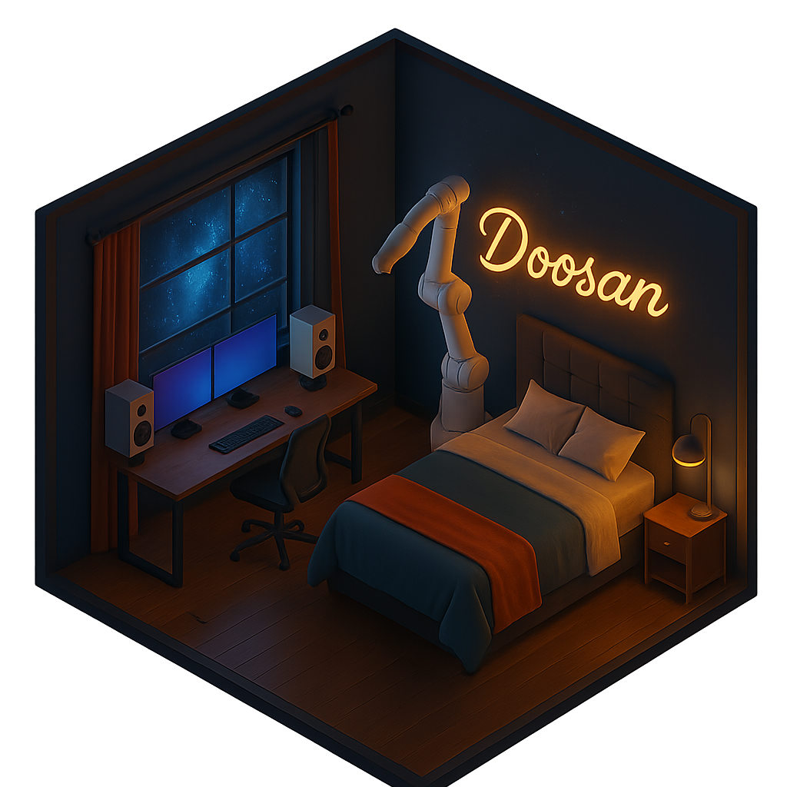
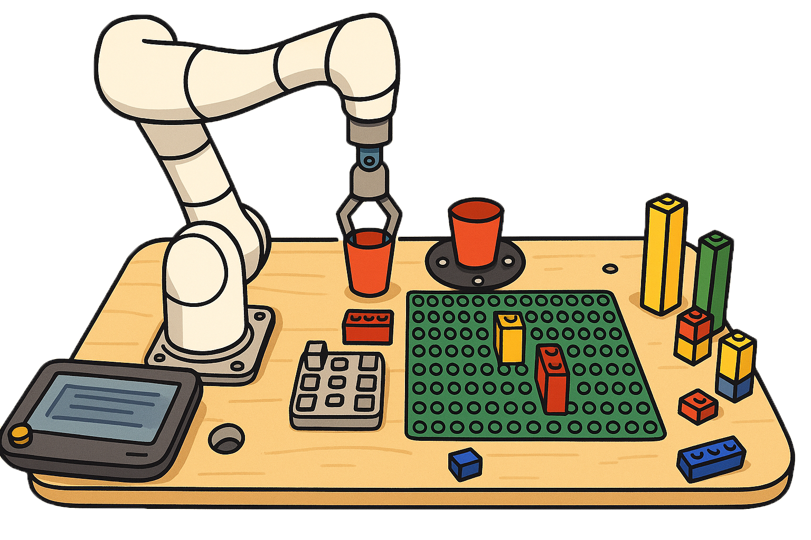
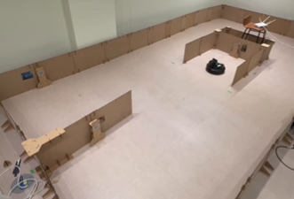

# 이한용
>- Tel  : 010-9892-2765  
>- E-mail: lhybio07@naver.com  
>- 📂[노션 포트폴리오](https://incongruous-beechnut-147.notion.site/172db0a7dd18804ba13ce5275575179a)

---
# SKILL

| 분야 | 기술 |
|------|------|
| AI | Python, OpenCV, Pytorch, Langchain, Gr00t|
| 시뮬레이션 | Isaacsim, Isaaclab, Gazebo, Lerobot|
| 데이터 | MySQL, PostgreSQL, statesmodel |
| ML | sklearn, statesmodel |
| 로봇 | ROS2 |

**보유 자격증**
- 2024.07.12  빅데이터분석기사
- 2023.11.17  데이터분석준전문가
- 2023.07.07  SQL개발자

---
# INDEX

**AI**
- [현대자동차 의왕연구소 Physical AI 교육 및 로봇 시연](#현대자동차-의왕연구소-Physical-AI-교육-및-로봇-시연)
- [Bussing Mate](#bussing-mate)
- [강화학습을 통한 자율주차](#강화학습을-통한-자율주차)

**로봇**
- [나만의 JARVIS](#나만의-jarvis)
- [러봇 하우스](#러봇-하우스)
- [도둑잡는 가이드 봇](#도둑잡는-가이드-봇)

**데이터**
- [IPO 자가진단 모델 개선](#ipo-자가진단-모델-개선)
- [원마트 매출 회복 프로젝트](#원마트-매출-회복-프로젝트)

---
# 프로젝트 요약

## AI

---
### 현대자동차 의왕연구소 Physical AI 교육 및 로봇 시연

> ##### 소개
>- 개발기간 : 2026.04.10 ~ 2026.05.08
>- 인원 : 1명
>- 핵심 역할 : 전체 개발 (개인 프로젝트)
>- 사용 기술 : Leisaac, Isaac sim, Lerobot, Gr00t

> ##### 요약
>- Leisaac으로 VLA 텔레옵 데이터를 적립하고 Gr00t 라이브러리로 학습하여 시뮬레이션 내 SoARM101이 지그를 삽입하는 VLA 프로젝트
>- 성공률: 빨간 블록 90% / 빨간+초록 70% / 3개 블록 10%
>- Github: https://github.com/machyong/leisaac_jig

---
### Bussing Mate

> ##### 소개
>- 개발기간 : 2025.11.10 ~ 2025.12.12
>- 인원 : 4명
>- 핵심 역할 : 팀장, 총괄, 기획
>- 사용 기술 : Python, ROS2, Pytorch, PPO, Isaacsim, Isaaclab

> ##### 요약
>- 기존 서빙로봇의 단점을 극복하기 위해 두산 로보틱스 E0509에 로봇팔을 달아 테이블 정리 서비스 제공. Isaac lab 기반 PPO 강화학습으로 로봇 동작 생성
>- Github: https://github.com/machyong/YongYiHanYong

---
### 강화학습을 통한 자율주차

> ##### 소개
>- 개발기간 : 2025.07.30 ~ 2025.09.04
>- 인원 : 2명
>- 핵심 역할 : 주차구역 인식 카메라 노드 개발, env/agent 환경 코드 수정, 학습 결과 분석
>- 사용 기술 : Python, ROS2, Tensorflow, DQN, OpenCV

> ##### 요약
>- 라이다 없이 카메라와 DQN 강화학습만으로 Gazebo 환경의 Turtlebot3가 자율주차를 수행. 최대 성공률 79%, 검증 평균 66%
>- Github: https://github.com/machyong/auto_parking

---
## 로봇

---
### 나만의 JARVIS

> ##### 소개
>- 개발기간 : 2025.06.28 ~ 2025.07.05
>- 인원 : 4명
>- 핵심 역할 : 노드 구조 및 service 통신 구조 제작, LangChain 기반 응답 시스템 구현, 코드 통합/관리
>- 사용 기술 : ROS2, YOLO, LangChain

> ##### 요약
>- LangChain과 두산 협동로봇을 사용하여 바쁜 현대인들을 위한 스마트홈 기반 출근 루틴 자동화 로봇 (커피/시리얼 준비, 일기예보, 음악 추천, 이불 정리)
>- Github:https://github.com/machyong/My_JARVIS

---
### 러봇 하우스

> ##### 소개
>- 개발기간 : 2025.06.10 ~ 2025.06.21
>- 인원 : 4명
>- 핵심 역할 : 협동 로봇의 힘제어와 위치값을 통한 설계도면 저장, 코드 통합/관리
>- 사용 기술 : ROS2

> ##### 요약
>- 두산 협동로봇이 건설 모형을 읽고 레고 블럭으로 건축물을 건설하는 무인 건설 로봇 프로젝트
>- Github: https://github.com/machyong/LoBotHouse

---
### 도둑잡는 가이드 봇

> ##### 소개
>- 개발기간 : 2025.05.27 ~ 2025.06.07
>- 핵심 역할 : 팀장, 멀티로봇 시스템 개발, 혼잡도 모델 개발
>- 사용 기술 : ROS2, Python, YOLO, SLAM

> ##### 요약
>- 박물관의 도슨트 서비스 불균형과 야간 경비 사각지대를 보완하기 위해 시작한 프로젝트 (터틀봇 4 사용)
>- Github: https://github.com/ROKEY-LearnedFromDoosan/GuardingRobot

---
## 데이터

---
### IPO 자가진단 모델 개선

> ##### 소개
>- 개발기간 : 2024.06.24 ~ 2024.07.12
>- 인원 : 4명
>- 핵심 역할 : 팀장, DBSCAN 기술등급 분류 모델 및 XGBoost IPO 예측 모델 설계/개발
>- 사용 기술 : pandas, sklearn, xgboost, DBSCAN

> ##### 요약
>- 기존 IPO 자가진단 시스템을 개선하여 예측 정확도 향상. KOSPI 상장 기업과 재무/비재무 데이터를 비교하는 시각화 대시보드 개발

---
### 원마트 매출 회복 프로젝트

> ##### 소개
>- 개발기간 : 2024.05.27 ~ 2024.06.07
>- 인원 : 4명
>- 핵심 역할 : 팀 리더, RFM 분석 및 K-means 군집화 모델 개발, SVD 기반 추천 시스템 구현
>- 사용 기술 : pandas, sklearn, surprise

> ##### 요약
>- 마트 고객 구매 데이터를 RFM + K-means로 5개 등급(VVIP~Normal) 세분화 후 SVD 기반 맞춤형 쿠폰 추천 시스템 구현. 모바일 알림 동의율 8% → 40% 개선
